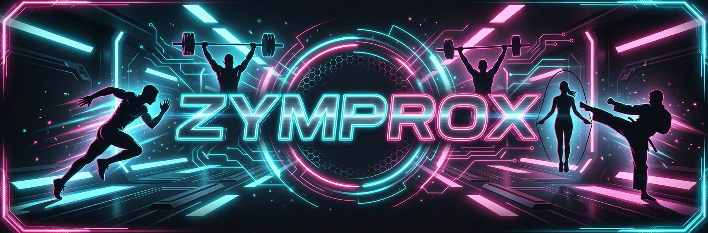

# 🏋️‍♂️ Zymprox - Transform Your Body



> **"Join the most advanced fitness community designed to shape your future."**

[](https://opensource.org/licenses/MIT)
[](https://developer.mozilla.org/en-US/docs/Web/Guide/HTML/HTML5)
[](https://developer.mozilla.org/en-US/docs/Web/CSS)
[](https://developer.mozilla.org/en-US/docs/Web/JavaScript)
[](https://youtube.com/@bforbca)

## 📖 About

**Zymprox** is a modern, high-energy landing page for a premium gym and fitness brand. It features a dark, neon-accented design that motivates users to take action. The project showcases responsive web design, interactive elements, and smooth animations without relying on heavy frameworks.

## ✨ Features

-   **📱 Fully Responsive Design**: Looks great on mobile, tablet, and desktop.
-   **🎨 Modern Aesthetics**: Dark mode theme with vibrant neon accents (`#00f3ff` & `#ff0055`).
-   **⚡ Dynamic Interactions**:
    -   Smooth scrolling navigation.
    -   Mobile-friendly hamburger menu.
    -   Sticky navbar with scroll effect.
-   **🏃‍♂️ Content Sections**:
    -   **Hero**: Impactful call-to-action.
    -   **Programs**: Cards showcasing different workout types (Strength, Cardio, HIIT, CrossFit).
    -   **Trainers**: Profiles of expert coaches.
    -   **Pricing**: Clear comparison of membership tiers.
    -   **Contact**: Functional-looking form with validation.
-   **✨ Animations**: Scroll-triggered fade-in effects using Intersection Observer.

## 🛠️ Tech Stack

-   **HTML5**: Semantic structure.
-   **CSS3**: Custom styling, Flexbox, Grid, and CSS Variables.
-   **JavaScript**: Vanilla JS for DOM manipulation and logic.
-   **Font Awesome**: For icons.
-   **Google Fonts**: Montserrat & Poppins typography.

## 🚀 Getting Started

To view this project locally on your machine:

1.  **Clone the repository**:
    ```bash
    git clone https://github.com/zymprox/zymweb.git
    ```
2.  **Navigate to the project directory**:
    ```bash
    cd zymweb
    ```
3.  **Open `index.html`**:
    Simply double-click the `index.html` file or open it with Live Server in VS Code.

## 📂 Project Structure

```
zymweb/
├── css/
│   └── styles.css      # Main stylesheet
├── images/             # Project assets (placeholders)
├── js/
│   └── script.js       # Main logic (menu, scroll, validation)
├── index.html          # Main entry point
└── README.md           # Project documentation
```

## 🤝 Contributing

Contributions, issues, and feature requests are welcome! Feel free to check the [issues page](https://github.com/zymprox/zymweb/issues).

1.  Fork the Project
2.  Create your Feature Branch (`git checkout -b feature/AmazingFeature`)
3.  Commit your Changes (`git commit -m 'Add some AmazingFeature'`)
4.  Push to the Branch (`git push origin feature/AmazingFeature`)
5.  Open a Pull Request

## 👤 Author

**@bforbca**

-   YouTube: [@bforbca](https://youtube.com/@bforbca)
-   GitHub: [zymprox](https://github.com/zymprox)

## 📄 License

Distributed under the MIT License. See `LICENSE` for more information.

---

*Built with 💪 and 💻 by @bforbca*
